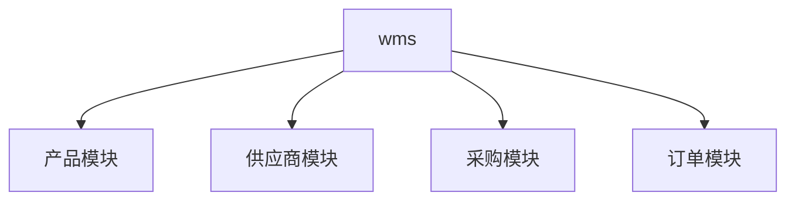

WMS系统
===============

> 运行环境要求PHP7.1+。

## 主要功能

* 共用采购模块、供应商模块、产品模块、订单模块

## 结构

## 路由
admin/wms/products?page=1&limit=10&sort=name&order=desc
/admin/wms/products/2
/admin/wms/product
/admin/wms/products/2
/admin/wms/products/97

|  方法 | 路由 | 参数 |备注|
| :---:|:------:|:----------:|:----------:|
| GET   | admin/wms/products   | page=1&limit=10&sort=name&order=desc| -  `page` int 

## 安装

~~~
composer install
~~~
