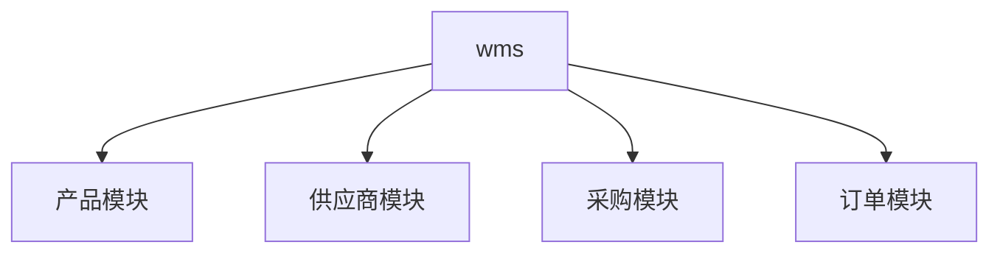

WMS系统
===============

> 运行环境要求PHP7.1+。

## 主要功能

* 共用采购模块、供应商模块、产品模块、订单模块

## 结构

```mermaid
graph TD;
  wms-->产品模块;
  wms-->供应商模块;
  wms-->采购模块;
  wms-->订单模块;
```

## 安装

~~~
composer install
~~~
